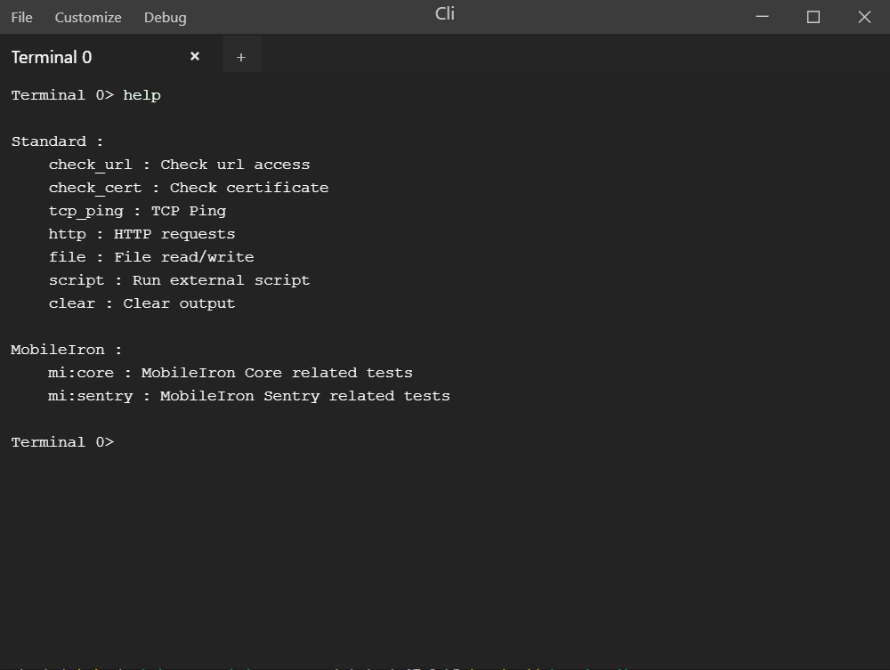
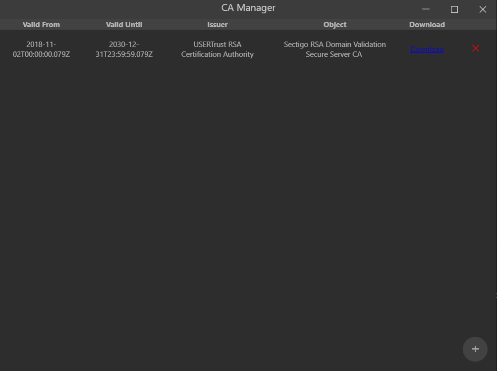

# Cli

This project was generated with [Angular CLI](https://github.com/angular/angular-cli) version 7.2.3.
It also uses [Electron](https://electronjs.org/) to be able to run it as standalone multi-platform application.

## Installation

- Install [NodeJS](https://nodejs.org) with [NPM](https://www.npmjs.com/) (include in the NodeJS installer)
- Run ````npm install````

## Run

Run `npm run electron` for dev purposes.


## Prod build

Run `npm run electron:win-build` in order to create the Windows build (located in `electron/build/prod`).


## Code architecture
````
.
+-- package.json (dependencies and npm scripts)
+-- src (Angular related files)
|   +-- app (Code in ts/scss/html format)
|   |     +-- components (Angular reusable commponents)
|   |     +-- pipes (Angular pipes)
|   |     +-- programs (CLI built-in programs)
|   |     +-- services (Angular services)
|   |     +-- types (Custom types)
|   +-- assets (Static files)
+-- electron (Electron related code)
|   +-- helpers (Helpers functions)
|   +-- models (Models)
|   +-- main.js (Electron entry file)
````

## Code scaffolding

Run `ng generate component component-name` to generate a new component. You can also use `ng generate directive|pipe|service|class|guard|interface|enum|module`.

## Screenshots




## Custom scripts 

Example can be found in ``./examples/scripts/``

### Available API
```javascript
/**
* Ask user to enter a value (string or number)
**/
in: (callback: (input value: string|number )=> void) => void 
/**
* Output a value with css and new line option(string or number)
**/
out: (value: any, customCSS?:string, newLine?:boolean) => void,
/**
* Shorthand for out without new line and css option
**/
print: (value: any, customCSS?:string) => void,
/**
* Shorthand for out with new line and css option
**/
println: (value: any, customCSS?:string) => void,
/**
* Shorthand for out for error (red and new line)
**/
printerr: (value: any) => void
/**
* Exit programm with exit code and optional data
**/
exit: (a: number, b?: any) => void,
/**
* Execute other command 
* if quiet, all output is hidden
**/
exec: (method: string, callback: (result?: Result)=> void, quiet?:boolean) => void
/**
* Clear n last lines
* if 0 clear all 
**/
clear: (line?: number) => void,
```

